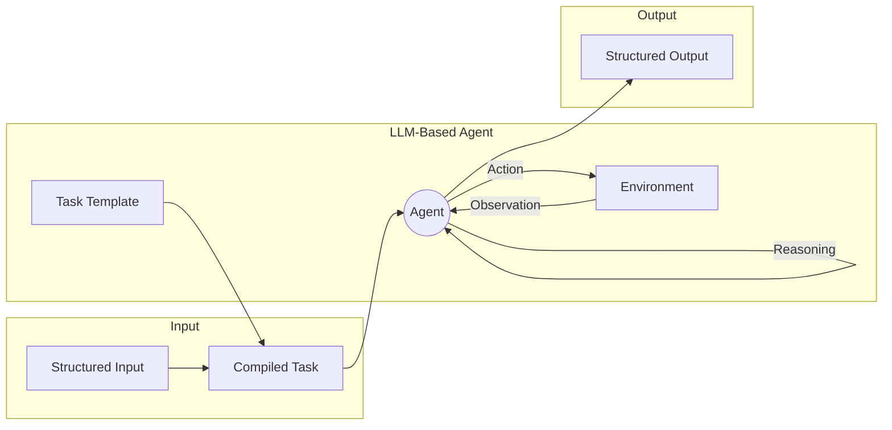

# Go LLM
[](https://github.com/natexcvi/go-llm/actions/workflows/go.yml)

Integrate the power of large language models (LLM) into your Go application.



## Usage Example
```go
package main

import (
	"encoding/json"
	"fmt"
	"os"

	"github.com/natexcvi/go-llm/agents"
	"github.com/natexcvi/go-llm/engines"
	"github.com/natexcvi/go-llm/memory"
	"github.com/natexcvi/go-llm/tools"
)

type CodeBaseRefactorRequest struct {
	Dir  string
	Goal string
}

func (req CodeBaseRefactorRequest) Encode() string {
	return fmt.Sprintf(`{"dir": "%s", "goal": "%s"}`, req.Dir, req.Goal)
}

func (req CodeBaseRefactorRequest) Schema() string {
	return `{"dir": "path to code base", "goal": "refactoring goal"}`
}

type CodeBaseRefactorResponse struct {
	RefactoredFiles map[string]string `json:"refactored_files"`
}

func (resp CodeBaseRefactorResponse) Encode() string {
	marshalled, err := json.Marshal(resp.RefactoredFiles)
	if err != nil {
		panic(err)
	}
	return string(marshalled)
}

func (resp CodeBaseRefactorResponse) Schema() string {
	return `{"refactored_files": {"path": "description of changes"}}`
}

func main() {
	task := &agents.Task[CodeBaseRefactorRequest, CodeBaseRefactorResponse]{
		Description: "You will be given access to a code base, and instructions for refactoring." +
			"your task is to refactor the code base to meet the given goal.",
		Examples: []agents.Example[CodeBaseRefactorRequest, CodeBaseRefactorResponse]{
			{
				Input: CodeBaseRefactorRequest{
					Dir:  "/Users/nate/code/base",
					Goal: "Handle errors gracefully",
				},
				Answer: CodeBaseRefactorResponse{
					RefactoredFiles: map[string]string{
						"/Users/nate/code/base/main.py": "added try/except block",
					},
				},
				IntermediarySteps: []*engines.ChatMessage{
					(&agents.ChainAgentThought{
						Content: "I should scan the code base for functions that might error.",
					}).Encode(engine),
					(&agents.ChainAgentAction{
						Tool: tools.NewBashTerminal(),
						Args: json.RawMessage(`{"command": "ls /Users/nate/code/base"}`),
					}).Encode(engine),
					(&agents.ChainAgentObservation{
						Content:  "main.py",
						ToolName: tools.NewBashTerminal().Name(),
					}).Encode(engine),
					(&agents.ChainAgentThought{
						Content: "Now I should read the code file.",
					}).Encode(engine),
					(&agents.ChainAgentAction{
						Tool: tools.NewBashTerminal(),
						Args: json.RawMessage(`{"command": "cat /Users/nate/code/base/main.py"}`),
					}).Encode(engine),
					(&agents.ChainAgentObservation{
						Content:  "def main():\n\tfunc_that_might_error()",
						ToolName: tools.NewBashTerminal().Name(),
					}).Encode(engine),
					(&agents.ChainAgentThought{
						Content: "I should refactor the code to handle errors gracefully.",
					}).Encode(engine),
					(&agents.ChainAgentAction{
						Tool: tools.NewBashTerminal(),
						Args: json.RawMessage(`{"command": "echo 'def main():\n\ttry:\n\t\tfunc_that_might_error()\n\texcept Exception as e:\n\t\tprint(\"Error: %s\", e)' > /Users/nate/code/base/main.py"}`),
					}).Encode(engine),
				},
			},
		},
		AnswerParser: func(msg string) (CodeBaseRefactorResponse, error) {
			var res CodeBaseRefactorResponse
			if err := json.Unmarshal([]byte(msg), &res); err != nil {
				return CodeBaseRefactorResponse{}, err
			}
			return res, nil
		},
	}
	agent := agents.NewChainAgent(engines.NewGPTEngine(os.Getenv("OPENAI_TOKEN"), "gpt-3.5-turbo-0613"), task, memory.NewBufferedMemory(0)).WithMaxSolutionAttempts(12).WithTools(tools.NewPythonREPL(), tools.NewBashTerminal())
	res, err := agent.Run(CodeBaseRefactorRequest{
		Dir:  "/Users/nate/Git/go-llm/tools",
		Goal: "Write unit tests for the bash.go file, following the example of python_repl_test.go.",
	})
	...
}
```
> **Note**
> 
> Fun fact: the `tools/bash_test.go` file was written by this very agent, and helped find a bug!

## Components
### Engines
Connectors to LLM engines. Currently only OpenAI's GPT chat completion API is supported.
### Tools
Tools that can provide agents with the ability to perform actions interacting with the outside world.
Currently available tools are:
- `PythonREPL` - a tool that allows agents to execute Python code in a REPL.
- `IsolatedPythonREPL` - a tool that allows agents to execute Python code in a REPL, but in a Docker container.
- `BashTerminal` - a tool that allows agents to execute bash commands in a terminal.
- `GoogleSearch` - a tool that allows agents to search Google.
- `WebpageSummary` - an LLM-based tool that allows agents to get a summary of a webpage.
- `WolframAlpha` - a tool that allows agents to query WolframAlpha's short answer API.
- `KeyValueStore` - a tool for storing and retrieving information. The agent can use this tool to re-use long pieces of information by-reference, removing duplication and therefore reducing context size.
- `AskUser` - an interactivity tool that lets the agent ask a human operator for clarifications when needed.
- `JSONAutoFixer` - a meta tool that is enabled by default. When the arguments to any tool are provided in a form that is not valid JSON, this tool attempts to fix the payload using a separate LLM chain.
- `GenericAgentTool` - lets an agent run another agent, with pre-determined tools, dynamically providing it with its task and input and collecting its final answer.

> **Warning**
> 
> The `BashTerminal` and regular `PythonREPL` tools let the agent run arbitrary commands on your machine, use at your own risk. It may be a good idea to use the built-in support for action confirmation callbacks (see the `WithActionConfirmation` method on the `ChainAgent` type).

#### Model-Native Function Calls
`go-llm` tools support the [new OpenAI function call interface](https://openai.com/blog/function-calling-and-other-api-updates?ref=upstract.com) transparently, for model variants that have this feature.

### Memory
A memory system that allows agents to store and retrieve information.
Currently available memory systems are:
- `BufferMemory` - which provides each step of the agent with a fixed buffer of recent messages from the conversation history.
- `SummarisedMemory` - which provides each step of the agent with a summary of the conversation history, powered by an LLM.

### Agents
Agents are the main component of the library. Agents can perform complex tasks that involve iterative interactions with the outside world.

### Prebuilt (WIP)
A collection of ready-made agents that can be easily integrated with your application.
